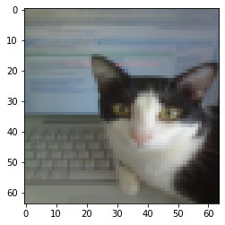
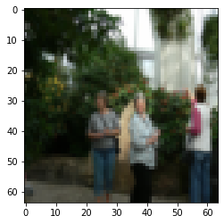
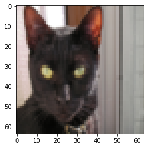
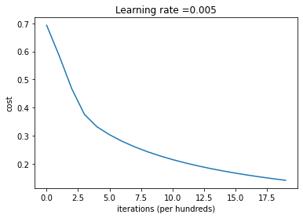
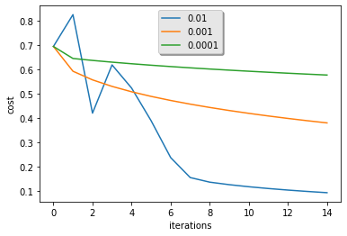

# Logistic Regression with a Neural Network mindset

Welcome!

In this project I am going to build a logistic regression classifier to recognize cats.

**By completion of this project, I've learn how to:** 

- Building the general architecture of a learning algorithm, including:
- Initializing parameters
- Calculating the cost function and its gradient
- Using an optimization algorithm (gradient descent)
- Gather all three functions above into a main model function, in the right order.


## 1 - Packages ##


First, let's run the cell below to import all the packages that will need for this Project.
- nmpy is the fundamental package for scientific computing with Python.
- h5py is a common package to interact with a dataset that is stored on an H5 file.
- matplotlib is a famous library to plot graphs in Python.
- PIL and scipy are used here to test model with our own picture at the end.


```python
import numpy as np
import matplotlib.pyplot as plt
import h5py
import scipy
from PIL import Image
from scipy import ndimage
from lr_utils import load_dataset

%matplotlib inline
```

## 2 - Overview of the Data set ##

**I have a dataset ("train_catvnoncat.h5" and "test_catvnoncat.h5") containing:**
    - a training set of m_train images labeled as cat (y=1) or non-cat (y=0)
    - a test set of m_test images labeled as cat or non-cat
    - each image is of shape (num_px, num_px, 3) where 3 is for the 3 channels (RGB). Thus, each image is square (height = num_px) and (width = num_px).

So, I am going to build a simple image-recognition algorithm that can correctly classify pictures as cat or non-cat.

Let's get more familiar with the dataset. Load the data by running the following code.


```python
# Loading the data (cat/non-cat)
train_set_x_orig, train_set_y, test_set_x_orig, test_set_y, classes = load_dataset()
```

I have added "_orig" at the end of image datasets (train and test) because I am going to preprocess them. After preprocessing, we will end up with train_set_x and test_set_x (the labels train_set_y and test_set_y don't need any preprocessing).

Each line of the train_set_x_orig and test_set_x_orig is an array representing an image. We can visualize an example by running the following code. Feel free also to change the `index` value and re-run to see other images. 


```python
# Example of a picture
index = 88
plt.imshow(train_set_x_orig[index])
print ("y = " + str(train_set_y[:, index]) + ", it's a '" + classes[np.squeeze(train_set_y[:, index])].decode("utf-8") +  "' picture.")
```

    y = [1], it's a 'cat' picture.


    

    


Many software bugs in deep learning come from having matrix/vector dimensions that don't fit. If you can keep your matrix/vector dimensions straight you will go a long way toward eliminating many bugs. 

So, I am going to find the values for:
    - m_train (number of training examples)
    - m_test (number of test examples)
    - num_px (= height = width of a training image)
Note that `train_set_x_orig` is a numpy-array of shape (m_train, num_px, num_px, 3). For instance, we can access `m_train` by writing `train_set_x_orig.shape[0]`.


```python

m_train = train_set_x_orig.shape[0]
m_test = test_set_x_orig.shape[0]
num_px = train_set_x_orig.shape[1]


print ("Number of training examples: m_train = " + str(m_train))
print ("Number of testing examples: m_test = " + str(m_test))
print ("Height/Width of each image: num_px = " + str(num_px))
print ("Each image is of size: (" + str(num_px) + ", " + str(num_px) + ", 3)")
print ("train_set_x shape: " + str(train_set_x_orig.shape))
print ("train_set_y shape: " + str(train_set_y.shape))
print ("test_set_x shape: " + str(test_set_x_orig.shape))
print ("test_set_y shape: " + str(test_set_y.shape))
```

    Number of training examples: m_train = 209
    Number of testing examples: m_test = 50
    Height/Width of each image: num_px = 64
    Each image is of size: (64, 64, 3)
    train_set_x shape: (209, 64, 64, 3)
    train_set_y shape: (1, 209)
    test_set_x shape: (50, 64, 64, 3)
    test_set_y shape: (1, 50)


For convenience, reshape images of shape (num_px, num_px, 3) in a numpy-array of shape (num_px $*$ num_px $*$ 3, 1). After this, the training (and test) dataset is a numpy-array where each column represents a flattened image. There is m_train (respectively m_test) columns.

Reshaping the training and test data sets so that images of size (num_px, num_px, 3) are flattened into single vectors of shape (num\_px $*$ num\_px $*$ 3, 1).

A trick to flatten a matrix X of shape (a,b,c,d) to a matrix X_flatten of shape (b$*$c$*$d, a) is to use: 
```python
X_flatten = X.reshape(X.shape[0], -1).T      # X.T is the transpose of X
```


```python
# Reshape the training and test examples


train_set_x_flatten = train_set_x_orig.reshape(train_set_x_orig.shape[0],-1).T
test_set_x_flatten = test_set_x_orig.reshape(test_set_x_orig.shape[0],-1).T


print ("train_set_x_flatten shape: " + str(train_set_x_flatten.shape))
print ("train_set_y shape: " + str(train_set_y.shape))
print ("test_set_x_flatten shape: " + str(test_set_x_flatten.shape))
print ("test_set_y shape: " + str(test_set_y.shape))
print ("sanity check after reshaping: " + str(train_set_x_flatten[0:5,0]))
```

    train_set_x_flatten shape: (12288, 209)
    train_set_y shape: (1, 209)
    test_set_x_flatten shape: (12288, 50)
    test_set_y shape: (1, 50)
    sanity check after reshaping: [17 31 56 22 33]


To represent color images, the red, green and blue channels (RGB) must be specified for each pixel, and so the pixel value is actually a vector of three numbers ranging from 0 to 255.

One common preprocessing step in machine learning is to center and standardize the dataset, meaning that substract the mean of the whole numpy array from each example, and then divide each example by the standard deviation of the whole numpy array. But for picture datasets, it is simpler and more convenient and works almost as well to just divide every row of the dataset by 255 (the maximum value of a pixel channel).

<!-- During the training of the model, I am going to multiply weights and add biases to some initial inputs in order to observe neuron activations. Then I'll backpropogate with the gradients to train the model. But, it is extremely important for each feature to have a similar range such that our gradients don't explode. !--> 

Let's standardize our dataset.


```python
train_set_x = train_set_x_flatten/255.
test_set_x = test_set_x_flatten/255.
```

<font color='blue'>

Common steps for pre-processing a new dataset are:
- Figuring it out the dimensions and shapes of the problem (m_train, m_test, num_px, ...)
- Reshaping the datasets such that each example is now a vector of size (num_px \* num_px \* 3, 1)
- "Standardize" the data

## 3 - General Architecture of the learning algorithm ##

It's time to design a simple algorithm to distinguish cat images from non-cat images.

To build a Logistic Regression, using a Neural Network mindset we need to understand the mathematical expression.

**Mathematical expression of the algorithm**:


**Key steps**:
In this exercise, I have learnt how to:

    - Initialize the parameters of the model
    - Learn the parameters for the model by minimizing the cost  
    - Use the learned parameters to make predictions (on the test set)
    - Analyse the results and conclude

## 4 - Building the parts of our algorithm ## 

The main steps for building a Neural Network are:
1. Defininng the model structure (such as number of input features) 
2. Initializing the model's parameters
3. Loop:
    - Calculate current loss (forward propagation)
    - Calculate current gradient (backward propagation)
    - Update parameters (gradient descent)


### 4.1 - Helper functions

As you've seen in the figure above, we need to compute sigmoid( w^T x + b) = \frac{1}{1 + e^{-(w^T x + b)}}$ to make predictions by using using np.exp().


```python
# GRADED FUNCTION: sigmoid

def sigmoid(z):


    s = 1/(1+np.exp(-z))
    
    return s
```


```python
print ("sigmoid([0, 2]) = " + str(sigmoid(np.array([0,2]))))
```

    sigmoid([0, 2]) = [0.5        0.88079708]


### 4.2 - Initializing parameters

Implementing parameter initialization in the cell below to initialize w as a vector of zeros.


```python
# GRADED FUNCTION: initialize_with_zeros

def initialize_with_zeros(dim):
    """
    This function creates a vector of zeros of shape (dim, 1) for w and initializes b to 0.
    
    Argument:
    dim -- size of the w vector we want (or number of parameters in this case)
    
    Returns:
    w -- initialized vector of shape (dim, 1)
    b -- initialized scalar (corresponds to the bias)
    """
    
    w = np.zeros([dim,1])
    b = 0

    assert(w.shape == (dim, 1))
    assert(isinstance(b, float) or isinstance(b, int))
    
    return w, b
```


```python
dim = 2
w, b = initialize_with_zeros(dim)
print ("w = " + str(w))
print ("b = " + str(b))
```

    w = [[0.]
     [0.]]
    b = 0


### 4.3 - Forward and Backward propagation

Now that my parameters are initialized, I can do the "forward" and "backward" propagation steps for learning the parameters.

Implementing a function `propagate()` that computes the cost function and its gradient.

Forward Propagation:
- get X
- compute $A = \sigma(w^T X + b) = (a^{(0)}, a^{(1)}, ..., a^{(m-1)}, a^{(m)})$
- calculate the cost function: $J = -\frac{1}{m}\sum_{i=1}^{m}y^{(i)}\log(a^{(i)})+(1-y^{(i)})\log(1-a^{(i)})$

Here are the two formulas that I will be using: 

$$ \frac{\partial J}{\partial w} = \frac{1}{m}X(A-Y)^T\tag{7}$$
$$ \frac{\partial J}{\partial b} = \frac{1}{m} \sum_{i=1}^m (a^{(i)}-y^{(i)})\tag{8}$$


```python
# GRADED FUNCTION: propagate

def propagate(w, b, X, Y):
    
    m = X.shape[1]
    
    # FORWARD PROPAGATION (FROM X TO COST)

    A = sigmoid(np.dot(w.T,X)+b)         # compute activation
    cost = (-1/m)*( np.dot(Y,np.log(A).T) + np.dot((1-Y),np.log(1-A).T) )        # compute cost

    
    # BACKWARD PROPAGATION (TO FIND GRAD)

    dw = (1/m)*( np.dot(X,(A-Y).T))
    db = (1/m)*np.sum((A-Y))
 

    assert(dw.shape == w.shape)
    assert(db.dtype == float)
    cost = np.squeeze(cost)
    assert(cost.shape == ())
    
    grads = {"dw": dw,
             "db": db}
    
    return grads, cost
```


```python
w, b, X, Y = np.array([[1],[2]]), 2, np.array([[1,2],[3,4]]), np.array([[1,0]])
grads, cost = propagate(w, b, X, Y)
print ("dw = " + str(grads["dw"]))
print ("db = " + str(grads["db"]))
print ("cost = " + str(cost))
```

    dw = [[0.99993216]
     [1.99980262]]
    db = 0.49993523062470574
    cost = 6.000064773192205


### d) Optimization
- I have initialized your parameters.
- I can able to compute a cost function and its gradient.
- Now, I want to update the parameters using gradient descent.

Writing optimization function. My goal is to learn $w$ and $b$ by minimizing the cost function $J$. For a parameter $\theta$, the update rule is $ \theta = \theta - \alpha \text{ } d\theta$, where $\alpha$ is the learning rate.


```python
# GRADED FUNCTION: optimize

def optimize(w, b, X, Y, num_iterations, learning_rate, print_cost = False):
    """
    This function optimizes w and b by running a gradient descent algorithm
    
    Arguments:
    w -- weights, a numpy array of size (num_px * num_px * 3, 1)
    b -- bias, a scalar
    X -- data of shape (num_px * num_px * 3, number of examples)
    Y -- true "label" vector (containing 0 if non-cat, 1 if cat), of shape (1, number of examples)
    num_iterations -- number of iterations of the optimization loop
    learning_rate -- learning rate of the gradient descent update rule
    print_cost -- True to print the loss every 100 steps
    
    Returns:
    params -- dictionary containing the weights w and bias b
    grads -- dictionary containing the gradients of the weights and bias with respect to the cost function
    costs -- list of all the costs computed during the optimization, this will be used to plot the learning curve.
    
    basically we need to write down two steps and iterate through them:
        1) Calculate the cost and the gradient for the current parameters by using propagate().
        2) Update the parameters using gradient descent rule for w and b.
    """
    
    costs = []
    
    for i in range(num_iterations):
        
        
        # Cost and gradient calculation 
        grads, cost = propagate(w, b, X, Y)

        
        # Retrieve derivatives from grads
        dw = grads["dw"]
        db = grads["db"]
        
        # update rule 
        w = w - learning_rate * dw
        b = b - learning_rate * db

        # Record the costs
        if i % 100 == 0:
            costs.append(cost)
        
        # Print the cost every 100 training examples
        if print_cost and i % 100 == 0:
            print ("Cost after iteration %i: %f" %(i, cost))
    
    params = {"w": w,
              "b": b}
    
    grads = {"dw": dw,
             "db": db}
    
    return params, grads, costs
```


```python
params, grads, costs = optimize(w, b, X, Y, num_iterations= 100, learning_rate = 0.009, print_cost = False)

print ("w = " + str(params["w"]))
print ("b = " + str(params["b"]))
print ("dw = " + str(grads["dw"]))
print ("db = " + str(grads["db"]))
print(costs)
```

    w = [[0.1124579 ]
     [0.23106775]]
    b = 1.5593049248448891
    dw = [[0.90158428]
     [1.76250842]]
    db = 0.4304620716786828
    [array(6.00006477)]


The previous function will output the learned w and b and now I am able to use w and b to predict the labels for a dataset X.

Now I am going to implementing the `predict()` function. There is two steps to computing predictions:

1. Calculate $\hat{Y} = A = \sigma(w^T X + b)$

2. Convert the entries of a into 0 (if activation <= 0.5) or 1 (if activation > 0.5), stores the predictions in a vector `Y_prediction`. I am using an `if`/`else` statement in a `for` loop (though there is also a way to vectorize this). 


```python
# GRADED FUNCTION: predict

def predict(w, b, X):
    '''
    Predicting whether the label is 0 or 1 using learned logistic regression parameters (w, b)
    
    Arguments:
    w -- weights, a numpy array of size (num_px * num_px * 3, 1)
    b -- bias, a scalar
    X -- data of size (num_px * num_px * 3, number of examples)
    
    Returns:
    Y_prediction -- a numpy array (vector) containing all predictions (0/1) for the examples in X
    '''
    
    m = X.shape[1]
    Y_prediction = np.zeros((1,m))
    w = w.reshape(X.shape[0], 1)
    
    # Compute vector "A" predicting the probabilities of a cat being present in the picture
 
    A = sigmoid(np.dot(w.T,X)+b)

    for i in range(A.shape[1]):
        
        # Convert probabilities A[0,i] to actual predictions p[0,i]
 
        if A[0,i] <= 0.5:
            Y_prediction[0, i] = 0
        else:
            Y_prediction[0, i] = 1

    
    assert(Y_prediction.shape == (1, m))
    
    return Y_prediction
```


```python
print ("predictions = " + str(predict(w, b, X)))
```

    predictions = [[1. 1.]]


<font color='blue'>

I've implemented several functions that:
    
- Initialize (w,b)
- Optimize the loss iteratively to learn parameters (w,b):
    - computing the cost and its gradient 
    - updating the parameters using gradient descent
- Use the learned (w,b) to predict the labels for a given set of examples

## 5 - Merge all functions into a model ##

Now we can see how the overall model is structured by putting together all the building blocks (functions implemented in the previous parts) together, in the right order.

Implementing the model function by using the following notation:
    - Y_prediction for the predictions on the test set
    - Y_prediction_train for the predictions on the train set
    - w, costs, grads for the outputs of optimize()


```python
# GRADED FUNCTION: model

def model(X_train, Y_train, X_test, Y_test, num_iterations = 2000, learning_rate = 0.5, print_cost = False):
    """
    Building the logistic regression model by calling the function you've implemented previously
    
    Arguments:
    X_train -- training set represented by a numpy array of shape (num_px * num_px * 3, m_train)
    Y_train -- training labels represented by a numpy array (vector) of shape (1, m_train)
    X_test -- test set represented by a numpy array of shape (num_px * num_px * 3, m_test)
    Y_test -- test labels represented by a numpy array (vector) of shape (1, m_test)
    num_iterations -- hyperparameter representing the number of iterations to optimize the parameters
    learning_rate -- hyperparameter representing the learning rate used in the update rule of optimize()
    print_cost -- Set to true to print the cost every 100 iterations
    
    Returns:
    d -- dictionary containing information about the model.
    """
    
    
    # initialize parameters with zeros (≈ 1 line of code)
    w, b = initialize_with_zeros(X_train.shape[0])

    # Gradient descent (≈ 1 line of code)
    parameters, grads, costs = optimize(w, b, X_train, Y_train, num_iterations, learning_rate, print_cost)
    
    # Retrieve parameters w and b from dictionary "parameters"
    w = parameters["w"]
    b = parameters["b"]
    
    # Predict test/train set examples (≈ 2 lines of code)
    Y_prediction_test = predict(w, b, X_test)
    Y_prediction_train = predict(w, b, X_train)

 

    # Print train/test Errors
    print("train accuracy: {} %".format(100 - np.mean(np.abs(Y_prediction_train - Y_train)) * 100))
    print("test accuracy: {} %".format(100 - np.mean(np.abs(Y_prediction_test - Y_test)) * 100))

    
    d = {"costs": costs,
         "Y_prediction_test": Y_prediction_test, 
         "Y_prediction_train" : Y_prediction_train, 
         "w" : w, 
         "b" : b,
         "learning_rate" : learning_rate,
         "num_iterations": num_iterations}
    
    return d
```

Run the following cell to train the model.


```python
d = model(train_set_x, train_set_y, test_set_x, test_set_y, num_iterations = 2000, learning_rate = 0.005, print_cost = True)
```

    Cost after iteration 0: 0.693147
    Cost after iteration 100: 0.584508
    Cost after iteration 200: 0.466949
    Cost after iteration 300: 0.376007
    Cost after iteration 400: 0.331463
    Cost after iteration 500: 0.303273
    Cost after iteration 600: 0.279880
    Cost after iteration 700: 0.260042
    Cost after iteration 800: 0.242941
    Cost after iteration 900: 0.228004
    Cost after iteration 1000: 0.214820
    Cost after iteration 1100: 0.203078
    Cost after iteration 1200: 0.192544
    Cost after iteration 1300: 0.183033
    Cost after iteration 1400: 0.174399
    Cost after iteration 1500: 0.166521
    Cost after iteration 1600: 0.159305
    Cost after iteration 1700: 0.152667
    Cost after iteration 1800: 0.146542
    Cost after iteration 1900: 0.140872
    train accuracy: 99.04306220095694 %
    test accuracy: 70.0 %


**Comment**: Training accuracy is close to 100%. This is a good sanity check: I guss my model is working and has high enough capacity to fit the training data. Test error is 70%. It is actually not bad for this simple model, given the small dataset I have used and that logistic regression is a linear classifier.

Also, I have seen that the model is clearly overfitting the training data. we have to reduce overfitting, for example by using regularization. Using the code below (and changing the `index` variable) we can look at predictions on pictures of the test set.


```python
# Example of a picture that was wrongly classified.
index = 21
plt.imshow(test_set_x[:,index].reshape((num_px, num_px, 3)))
print ("y = " + str(test_set_y[0,index]) + ", you predicted that it is a " + classes[int(d["Y_prediction_test"][0,index])].decode("utf-8") +  " picture.")
```

    y = 0, you predicted that it is a non-cat picture.


    

    


```python
# Example of a picture that was correctly classified.
index = 9
plt.imshow(test_set_x[:,index].reshape((num_px, num_px, 3)))
print ("y = " + str(test_set_y[0,index]) + ", you predicted that it is a " + classes[int(d["Y_prediction_test"][0,index])].decode("utf-8") +  " picture.")
```

    y = 1, you predicted that it is a cat picture.


    

    


Let's also plot the cost function and the gradients.


```python
# Plot learning curve (with costs)
costs = np.squeeze(d['costs'])
plt.plot(costs)
plt.ylabel('cost')
plt.xlabel('iterations (per hundreds)')
plt.title("Learning rate =" + str(d["learning_rate"]))
plt.show()
```


    

    


**Interpretation**:
I can see that the cost decreasing. It shows that the parameters are being learned. However, I could train the model even more on the training seta and try to increase the number of iterations in the cell above and rerun the cells. I can also see that the training set accuracy goes up, but the test set accuracy goes down. This is called overfitting. 

## 6 - Further analysis##

Let's analyze it further, and examine possible choices for the learning rate $\alpha$. 

#### Choice of learning rate ####

In order for Gradient Descent to work we must choose the learning rate wisely. The learning rate $\alpha$  determines how rapidly we update the parameters. If the learning rate is too large we may "overshoot" the optimal value. Similarly, if it is too small we will need too many iterations to converge to the best values. That's why it is crucial to use a well-tuned learning rate.

Let's compare the learning curve of our model with several choices of learning rates by running the cell below. This should take about 1 minute. Feel free also to try different values than the three I have initialized the `learning_rates` variable to contain, and see what happens. 


```python
learning_rates = [0.01, 0.001, 0.0001]
models = {}
for i in learning_rates:
    print ("learning rate is: " + str(i))
    models[str(i)] = model(train_set_x, train_set_y, test_set_x, test_set_y, num_iterations = 1500, learning_rate = i, print_cost = False)
    print ('\n' + "-------------------------------------------------------" + '\n')

for i in learning_rates:
    plt.plot(np.squeeze(models[str(i)]["costs"]), label= str(models[str(i)]["learning_rate"]))

plt.ylabel('cost')
plt.xlabel('iterations')

legend = plt.legend(loc='upper center', shadow=True)
frame = legend.get_frame()
frame.set_facecolor('0.90')
plt.show()
```

    learning rate is: 0.01
    train accuracy: 99.52153110047847 %
    test accuracy: 68.0 %
    
    -------------------------------------------------------
    
    learning rate is: 0.001
    train accuracy: 88.99521531100478 %
    test accuracy: 64.0 %
    
    -------------------------------------------------------
    
    learning rate is: 0.0001
    train accuracy: 68.42105263157895 %
    test accuracy: 36.0 %
    
    -------------------------------------------------------
    


    

    


**Interpretation**: 

- Different learning rates give different costs and thus different predictions results.
- If the learning rate is too large (0.01), the cost may oscillate up and down. It may even diverge (though in this example, using 0.01 still eventually ends up at a good value for the cost). 
- A lower cost doesn't mean a better model. We have to check if there is possibly overfitting. It happens when the training accuracy is a lot higher than the test accuracy.
- In deep learning:

    - Choose the learning rate that better minimizes the cost function.
    - If the model overfits, use other optimization techniques to reduce overfitting.


## 7 - Test with your own image ##

We can use our own image and see the output of the model. To do that:
    1. Click on "File" in the upper bar of this notebook.
    2. Add your image to this file directory, in the "images" folder
    3. Change your image's name in the following code
    4. Run the code and check if the algorithm is right (1 = cat, 0 = non-cat)!


```python
##(PUT YOUR IMAGE NAME) 
my_image = "cat_in_iran.jpg"   # change this to the name of your image file 

# Preprocess the image to fit model algorithm.
fname = "images/" + my_image
image = np.array(plt.imread(fname))
my_image = np.array(Image.fromarray(image).resize([num_px,num_px])).reshape((1, num_px*num_px*3)).T
my_predicted_image = predict(d["w"], d["b"], my_image)

plt.imshow(image)
print("y = " + str(np.squeeze(my_predicted_image)) + ", your algorithm predicts a \"" + classes[int(np.squeeze(my_predicted_image)),].decode("utf-8") +  "\" picture.")
```

<font color='blue'>
**What I did in this project:**
    
1. Preprocessing the dataset is important.
2. Implemented each function separately: initialize(), propagate(), optimize(). Then I built a model().
3. Tuning the learning rate (which is an example of a "hyperparameter") can make a big difference to the algorithm.
